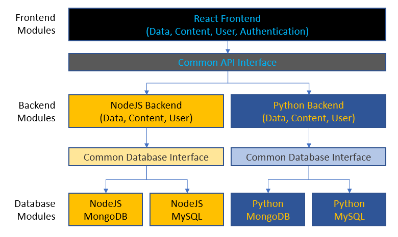

Frappy is a framework for accelerated demo and prototype development, handling common problems such as authentication,
 users, content and data management, so you can focus on the actual demo content immediately without spending valuable
 days setting up the basic needs that exist in almost every project.

This repository contains documentation to all aspects of the Frappy modules and packages, how to use them and extend.

1. [Detailed Documentation](#detailed-documentation)
2. [Getting Started](#getting-started)
3. [Capabilities](#capabilities)
4. [Structure](#structure)
5. [Usage](#usage)
6. [Packages](#packages)

## Detailed Documentation

- [Integrating Admin Interfaces](admin-interfaces.md)
- [Databases](databases.md)
- [User Guide](user-guide.md)
- [Authentication and User Management](authentication-users.md),
- [Content Management](content.md)
- [Data Management (Images, CSV, JSON)](datasets.md)
- [Data Structures](data-structure.md)

## Getting Started

- Read the [User Guide](user-guide.md), which explains the database choice and leads you through setting up your project
- Create your own frontend pages, where you display the information you want users to see. You can use existing
 endpoints that are registered with the backend modules or create your own to retrieve data and content. Details
 regarding those endpoints can be found in the respective **frontend** packages and are the same for NodeJS and Python.
- Create your own API endpoints that perform operations on the data. You can pass the required store instances (e.g.
 `DataSetStore`) into the API registration function and use it to retrieve the data there, when one of your endpoints is
  called.
    - Call your own analytics/computation code from these custom endpoints and return the result of the analytics.
    - Examples for how to write API endpoints can be found
    [here](https://github.com/ilfrich/frappy-node-content/blob/master/src/manage-endpoints.mjs) (NodeJS) and
    [here](https://github.com/ilfrich/frappy-flask-content/blob/master/frappyflaskcontent/content_api.py) (Python)

## Capabilities

- **Backend languages & frameworks**: NodeJS with Express or Python with Flask
- **Databases**: MongoDB or/and MySQL
- **Frontend**: React only
- **Functionality**:
    - [Authentication and User Management](authentication-users.md),
    - [Content Management](content.md),
    - [Data Management (Images, CSV, JSON)](datasets.md)

## Structure

The various components work together by shared interfaces for the REST communication and database store methods:

## Usage

1. Select your backend language: Node (JS) or Python
2. Create a new GitHub project using one of the 2 project templates:
 [NodeJS template](https://github.com/ilfrich/frappy-node-react-template) or
 [Python template](https://github.com/ilfrich/frappy-flask-react-template)
3. Choose your database (MongoDB or MySQL). This will inform which packages you need in the next step. It is recommended
 to use Docker to run the database, unless you're a pro.
4. Select what functionality you need and install the required packages for:
    1. The database storage
    2. The backend
    3. The frontend
5. Integrate the installed functionality into your project repository

For a detailed guide, please see the [User Guide](user-guide.md).

## Packages

These packages are currently available:

|                 | Python Databases | NodeJS Databases | Python Backend | NodeJS Backend | Frontend |
|-----------------|---|---|---|---|---|
| Authentication  | [frappymongouser](https://github.com/ilfrich/frappy-py-mongo-user-store) | [js-mongo-user-store](https://github.com/ilfrich/frappy-js-mongo-user-store) | [frappyflaskauth](https://github.com/ilfrich/frappy-flask-authentication) | [node-authentication](https://github.com/ilfrich/frappy-node-authentication) | [react-authentication](https://github.com/ilfrich/frappy-react-authentication) |
| Data            | [frappymongodata](https://github.com/ilfrich/frappy-py-mongo-dataset-store) | [js-mongo-dataset-store](https://github.com/ilfrich/frappy-js-mongo-dataset-store) | [frappyflaskdata](https://github.com/ilfrich/frappy-flask-datasets) | [node-datasets](https://github.com/ilfrich/frappy-node-datasets) | [react-datasets](https://github.com/ilfrich/frappy-react-datasets) |
| Content         | [frappymongocontent](https://github.com/ilfrich/frappy-py-mongo-content-store) | [js-mongo-content-store](https://github.com/ilfrich/frappy-js-mongo-content-store) | [frappyflaskcontent](https://github.com/ilfrich/frappy-flask-content) | [node-content](https://github.com/ilfrich/frappy-node-content) | [react-content](https://github.com/ilfrich/frappy-react-content) |
